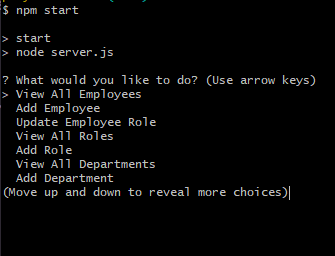

# Challenge 12 Employee Tracker
### Week 6 DU bootcamp challenge

### License
MIT

### Description
The challenge: creating a command line app that tracks employees, roles, and departments in a generic workplace setting.

### Usage
npm start in the terminal and arrow buttons to choose prompts

